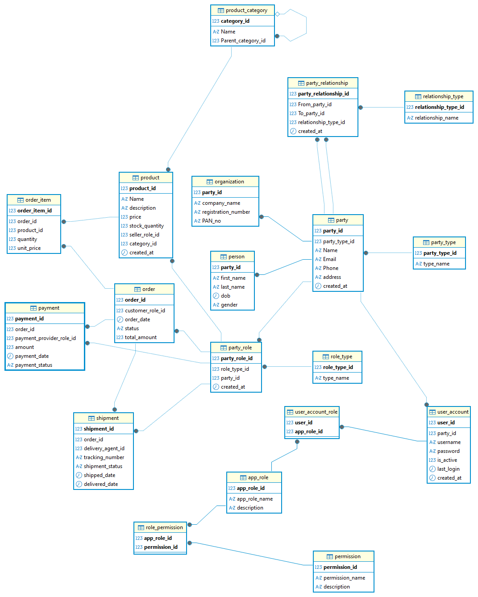

# party-role-model-ecommerceDB
This project demonstrates the general workflow of ecommerce database, where individuals or organizations can buy and sell products, place orders, and make payments. It serves as an example implementation of a database schema using the party role model.

## Goal
The goal is to demonstrate how an e-commerce system can manage:
- Individuals and organizations(Parties).
- Their dynamic roles (eg., Customer, seller, delivery agent, payment provider)
- Relationships between parties (e.g., Seller-Distributor, partner)
- products, categories, orders and order items
- Payments and shipments
- User authentication and authorization (RBAC)
We can extend the schema further to support discounts, reviews, shopping carts, and inventory management.

## Core Concepts Modeled
- Parties (individuals and organizations)
- Roles they play (e.g., Customer, seller, Delivery Agent, payment provider)
- Relationships between parties (e.g., Supplier provides to seller)
- Products & categories (hierarchical classification of products) 
- Orders & Items
- Extended party details (Person and Organizations subtypes)
- User accounts with RBAC (roles and permissions for platform access)

## Tables and Relationships

|     Table                 |                       Purpose                                     |
|---------------------------|--------------------------------------------------------------------
|   `PartyType`             | Defines types of parties (e.g., Person, Organization)             |
|   `Party`                 | Main entity table for parties                                     |
|   `RoleType`              | Defines roles parties can play (e.g., customer, seller, agent)    |
|   `PartyRole`             | Assigns roles to partie with time tracking                        |
|   `PartyRelationshipType` | Defines types of relationship between party roles                 |
|   `PartyRelationship`     | Captures specific relationships between two parties               |
|   `product`               | Stores product details (price, stock, seller reference)           |
|   `order`                 | Customer order record with status and total amount                |
|   `order_item`            | Items within an order                                             | 
|   `payment`               | Payment details with provider, status and date                    |
|   `Person`                | Person-specific data (e.g., DOB, Gender)                          | 
|   `Organization`          | Organization-specific data (e.g., Address, reg)                   |
|   `user_account`          | Login credentials linked to a party                               |
|   `app_role`              | Defines applications roles (Admin, user)                          |
|   `permission`            | Defines system permission                                         |
|   `role_permission`       | Assigns permissions to roles                                      |
|   `user_account_role`     | Links user accounts to application roles                          |
|   `product_category`      | defines categories (support parent-child hierarchy)               |

## Here's the ER Diagram:

